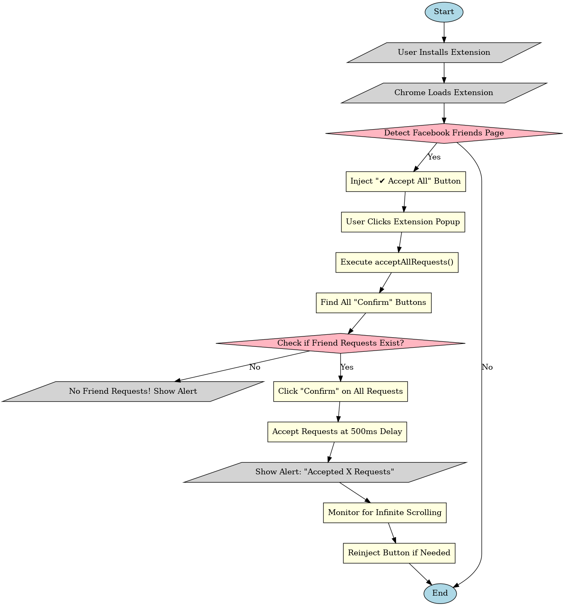

# 🚀 Facebook Friend Request Auto-Accepter

## One-Click Automation for Accepting All Friend Requests on Facebook!

---

## 📌 Overview
Manually accepting **hundreds of friend requests** is time-consuming and frustrating. This **Chrome Extension** adds an **"Accept All"** button to Facebook’s **Friends page**, allowing you to accept all friend requests with a single click! 🎯

---

## 📜 Flowchart
This flowchart explains how the extension works:


---

## 🔧 Features
- ✅ **Auto-injects an "Accept All" button** into Facebook’s UI to look like a built-in feature.  
- ✅ **One-click bulk acceptance** of all friend requests.  
- ✅ **Handles infinite scrolling**—keeps accepting requests even if more load dynamically.  
- ✅ **Prevents errors**—if there are no requests, it shows a friendly alert.  
- ✅ **Lightweight & Secure**—No external dependencies!  

---

## 📌 Installation Guide
1. **Clone or Download** this repository:
   ```bash
   git clone https://github.com/yourusername/facebook-auto-accept.git
   ```
2. Navigate to the **Code** folder in Repo
3. Goto the Extension section on Chrome by this link ```chrome://extensions/```
4. Make Sure the **Developer Mode** should checks on by the top right side of page.
5. Click on **Load Unpacked** button on top left side of the page.
6. Then select the **Code** folder from the Repo.
7. Make sure the extension should be *On*
8. Goto facebook frineds page or reload ```https://www.facebook.com/friends``` page to watch the *Accept All* button.
   
---
## 🎥 Demo
Watch how it works: [Link](https://drive.google.com/file/d/1VpgS_X08LVp9H_WvGD1nOFhqtkHYnp6-/view?usp=sharing)
